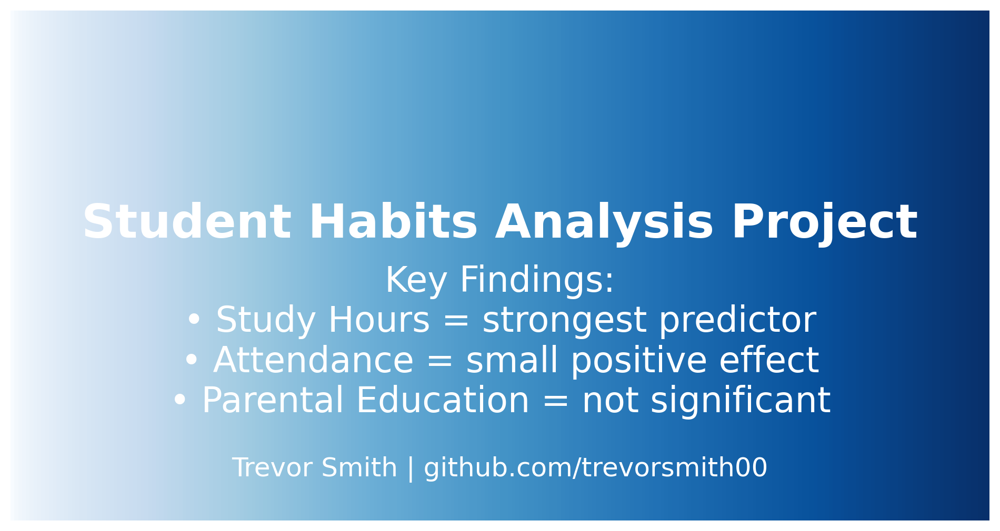

# Student Habits Analysis Project

Welcome to my data analytics project exploring how student habits influence academic performance.

This project uses statistical analysis and machine learning to investigate how variables such as study hours, attendance, extracurricular participation, and parental background affect exam scores.

---

## 📊 Key Findings

✅ **Study Hours** → Strongest predictor of exam scores  
✅ **Attendance** → Weak but significant positive effect  
✅ **Parental Education Level** → No statistically significant effect in this dataset  
✅ **Extracurricular Participation** → No significant impact detected  

---

## 📄 Project Report

👉 [**Download Full Combined Report (PDF)**](Student_Habits_Combined_Report.pdf)

---

## ⚙️ Methodology

- Data preprocessing & feature encoding
- Exploratory data visualization
- Correlation analysis (Pearson, Spearman)
- ANOVA testing for categorical variables
- Multiple linear regression model built to predict exam scores

---

## 📂 Project Files

- [**Python Analysis Code**](Student_Habits_Analysis.py)  
- [**Regression Report**](Student_Habits_Regression_Report.pdf)  
- [**Combined Analysis Report**](Student_Habits_Combined_Report.pdf)  
- [**Cleaned Dataset**](cleaned_student_performance.csv)

---

## 💬 About

This project was developed as part of my data analytics portfolio to demonstrate skills in:

- Data cleaning & transformation  
- Statistical analysis  
- Model building (Multiple Linear Regression)  
- Visualization & reporting  
- Communicating data insights effectively  

---

*Created by Trevor Smith*  
GitHub: [https://github.com/trevorsmith00](https://github.com/trevorsmith00)  

